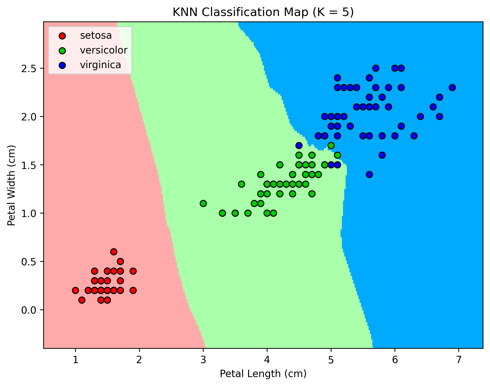

# 🌸 Iris Species Classifier using K-Nearest Neighbors (KNN)

Welcome to the **DecodeLabs Internship Project 2**! This project implements an end-to-end Machine Learning pipeline to classify flowers from the classic **Iris Dataset** into three distinct species using the **K-Nearest Neighbors (KNN)** algorithm.

> [!NOTE]
> This is a project developed under the **DecodeLabs Internship** program to master fundamental concepts in data preprocessing, supervised learning, and classification model evaluation.

---

## 🗺️ Visualizing the Classifier
Below is the pre-computed KNN Classification Boundary Map ($K = 5$) plotting **Petal Length** against **Petal Width**. It highlights how the model segments the 2D feature space to classify each species.



---

## 🧠 Main Concepts Learned

During the development of this project, several key Machine Learning concepts were practically explored and implemented:

1. **Exploratory Data Analysis (EDA)**
   - Loaded and structured raw data into an analytical [Pandas](https://pandas.pydata.org/) DataFrame.
   - Handled target mapping to replace numeric labels (`0`, `1`, `2`) with readable species names (`setosa`, `versicolor`, `virginica`).

2. **Feature Scaling (Standardization)**
   - Utilized `StandardScaler` from `scikit-learn` to standardize features by removing the mean and scaling to unit variance:
     $$z = \frac{x - \mu}{\sigma}$$
   - *Why it matters:* Distance-based algorithms like KNN are highly sensitive to the scale of input features. Scaling ensures that all features contribute equally to distance calculations.

3. **Supervised Classification with KNN**
   - Employed the K-Nearest Neighbors (KNN) algorithm with a hyperparameter of $K = 5$.
   - Learned the importance of finding a balanced $K$ value to avoid underfitting (too large) or overfitting (too small).

4. **Robust Model Evaluation**
   - Implemented a holdout validation split (80/20 train-test ratio).
   - Generated and interpreted **Confusion Matrices** and **Classification Reports** containing Precision, Recall, F1-Score, and Support.

---

## ✨ Features

- **Automated Data Pipeline**: Loads, cleans, and structures raw iris data.
- **Robust Preprocessing**: Integrates standard scaling for numerical features.
- **High-Accuracy Classification**: Achieves **100% classification accuracy** on the test dataset.
- **Rich Performance Visuals**: Computes detailed performance metrics including a class-by-class precision breakdown.
- **Clean Code Architecture**: The entire pipeline is compactly organized in a single, well-documented script.

---

## 📁 Repository Structure

*   [model.py](file:///home/adam/Project-2-decodelabs-internship/model.py) — Core Python script with the ML training & evaluation logic.
*   [knn_decision_boundary.png](file:///home/adam/Project-2-decodelabs-internship/knn_decision_boundary.png) — Generated visualization of the decision boundary.
*   [LICENSE](file:///home/adam/Project-2-decodelabs-internship/LICENSE) — MIT License documentation.
*   [README.md](file:///home/adam/Project-2-decodelabs-internship/README.md) — Main project documentation (this file).

---

## 🚀 Setup & Execution

Follow these instructions to set up the environment and run the classification pipeline locally.

### Prerequisites
Make sure you have Python 3.8+ installed on your system.

### 1. Clone & Navigate to Project Directory
```bash
git clone <repository-url>
cd Project-2-decodelabs-internship
```

### 2. Set Up Virtual Environment (Recommended)
Creating a virtual environment ensures that the project dependencies do not conflict with global libraries.

**On Linux / WSL (Ubuntu):**
```bash
python3 -m venv venv
source venv/bin/activate
```

**On Windows (PowerShell):**
```powershell
python -m venv venv
.\venv\Scripts\Activate.ps1
```

### 3. Install Dependencies
Install the required scientific computing libraries:
```bash
pip install -r requirements.txt
```
*(Or manually install them)*:
```bash
pip install pandas scikit-learn matplotlib
```

### 4. Run the Pipeline
Execute the Python script to see the preview, confusion matrix, and classification report:
```bash
python model.py
```

---

## 📊 Model Performance & Results

### 1. Confusion Matrix
The confusion matrix indicates zero misclassifications across all test samples, showing a clean diagonal matrix:

```text
[[10  0  0]
 [ 0  9  0]
 [ 0  0 11]]
```

### 2. Classification Metrics

The KNN classifier ($K=5$) achieved a perfect **1.00 (100%) accuracy** across the test suite:

| Species | Precision | Recall | F1-Score | Support |
| :--- | :---: | :---: | :---: | :---: |
| **Setosa** | 1.00 | 1.00 | 1.00 | 10 |
| **Versicolor** | 1.00 | 1.00 | 1.00 | 9 |
| **Virginica** | 1.00 | 1.00 | 1.00 | 11 |
| **Accuracy** | | | **1.00** | **30** |
| **Macro Avg** | 1.00 | 1.00 | 1.00 | 30 |
| **Weighted Avg** | 1.00 | 1.00 | 1.00 | 30 |

> [!IMPORTANT]
> A perfect classification score indicates excellent separability of classes in the test split. However, on real-world noisy data, cross-validation is usually advised to confirm generalizability.

---

## 📜 License

This project is open-source and licensed under the **MIT License**. 
See the [LICENSE](file:///home/adam/Project-2-decodelabs-internship/LICENSE) file for details.

Copyright © 2026 **Mr. Adam KHOBBA**.
